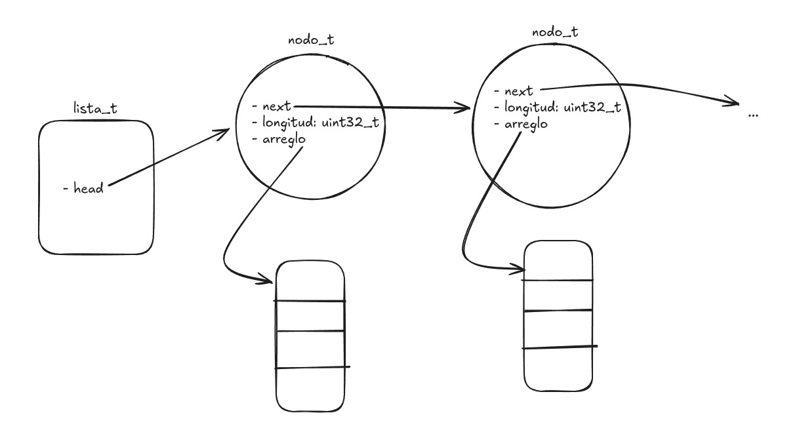

# Preguntas teóricas

### Ejercicio Lista Enlazada:

[1] 

[2] Si dentro de una función cualquiera, creamos una lista haciendo `lista_t* mi_lista = nueva_lista();`, y luego otra haciendo `lista_t mi_otra_lista;` ¿en qué segmentos de memoria se alojan las siguientes variables?:

- `mi_lista`: El puntero se aloja en el stack, porque es una variable local dentro de una función, pero la estructura se va a alojar en el segmento heap, pues corresponde a una variable dinamica administrada por malloc. 

- `mi_otra_lista`: es simplemente la declaracion de la variable, entonces se va a alojar en el stack, pues aun no se le aloco memoria.

- `mi_otra_lista.head`: tambien esta en el stack, pues es un campo de mi_otra_lista (y aún no se pidió memoria con malloc), que tambien esta en el stack. 

- `mi_lista->head`: tambien esta en el HEAP, pues es un campo de un struct que esta en el HEAP.

- Si a `mi_otra_lista` la creamos fuera de cualquier funcion, va a ir al segmento BSS, donde van las variables globales no inicializadas.

### Ejercicio Classify Chars
[1] ¿Por qué cuándo declaramos un string en C no hace falta especificar su tamaño de antemano?
- En C, no hace falta declarar el tamaño de un string ya que se representan como arreglos de chars, y el char '\0' es el que determina cuando finaliza el string

[2] Supongamos que ahora nos interesa implementar una función para retornar ambas listas de vocales y consonantes. El lenguaje C no nos provee ninguna forma sintáctica de retornar más de un dato de una función. Explorar distintas formas que se podría resolver este problema (al menos dos formas distintas, y que funcionen).

Elegimos dos opciones: <b>devolver un struct</b> y <b>devolver punteros a arreglos</b>.

- En la version classify_chars_v2 hicimos que la funcion reciba punteros a arreglos, y que modifique esos arreglos, siendo esos los parametros de salida.

- En la version classify_chars_v3 hicimos que la funcion reciba solamente el string, y que inicialize un arreglo de structs, siendo cada struct el resultado de cada string, respectivamente.
De este modo, hacemos que cada struct le corresponda a un string, es decir, cada struct tiene un campo que se llama vocales y otro que se llama consonantes.
